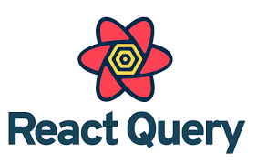

  

# react-query-template

## 🛠️ Built with:

 - [React](https://react.dev/)
 - [Express](https://expressjs.com/)

## Getting Started

Follow these steps to get the project up and running on your local machine.

1. CLONE THE REPO
`git clone https://github.com/clinton-mwachia/react-query-template.git`

2. Create an `.env` file With the following:
 - DB=mongodb://127.0.0.1:27017/db-name (NOTE: you can use any other DB)
 - PORT=8010
 - API=/api/v0
3. Start the server: `cd server` && `npm run dev`

4. Start the client: `cd client` && `npm run dev`

## Features
1. View All Posts

2. Search Posts + suggestions

3. Post Comments

3. Update Comment

